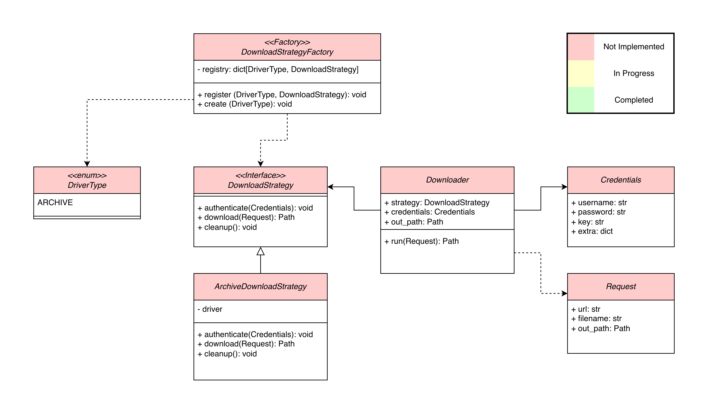

    
    

# BMI-SOFT-Signal_Processing_ML

This repository is responsible for the handling of the EMG decoding pipeline: from the raw data to an effective decoder!

## Handling the Data
Because we have an in-house data acquisition pipeline we need a pipeline for Downloading and Loading the data. The downloading the data is currently being implemented and should follow the following architecture:

The loading the follows a `mne` based approach with simple inheritance from a Loader class
