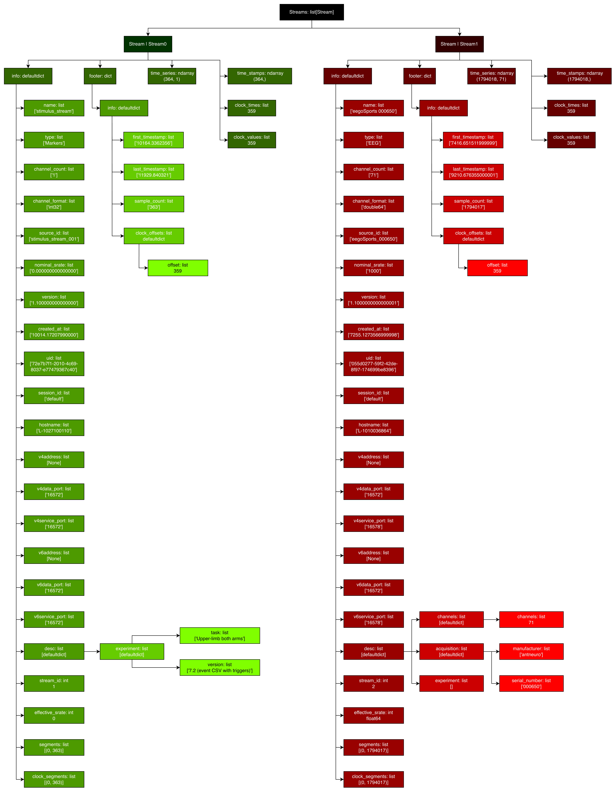

# How is the `.xdf` file organized
The file follows the structure of two streams and a header.

## Streams

Each stream has different meanings: The first one is responsible for markers storage while the second stores the actual signal (EEG and EMG)

### Marker Stream
`streams[0]["time_stamps"]` - Stores the timepoints when a marker happens

`streams[0]["time_series"]` - Stores what marker is present there

In this case we only have one channel, so the acess is trivial. We have 63 different markers in the test session. Each one has a specific meaning and can be decoded at the correct section.

### Signal Stream
`streams[1]["time_stamps"]`- Of shape (1794018,) represents the time axis

`streams[1]["time_series"]` - Of shape (1794018, 71) stores the values of each channel
